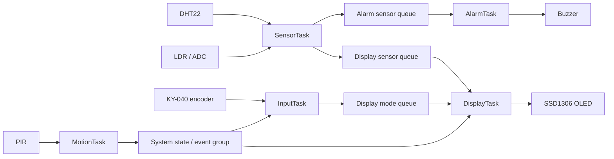
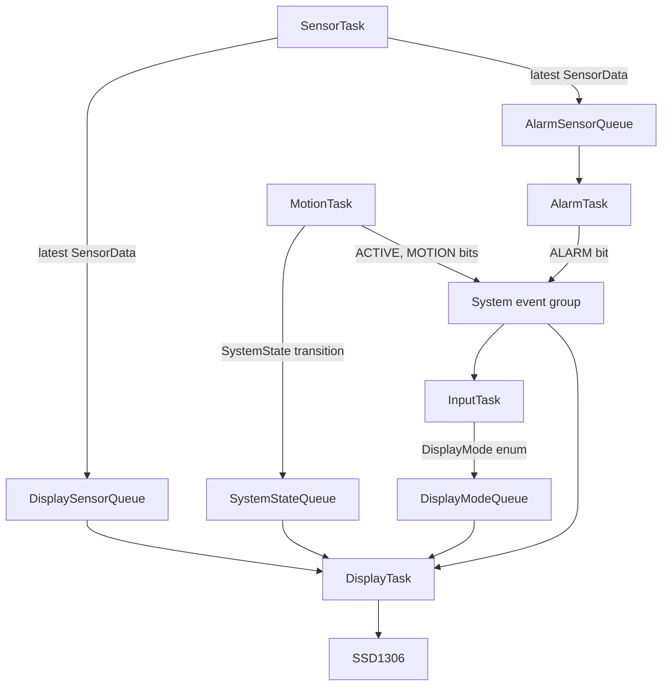
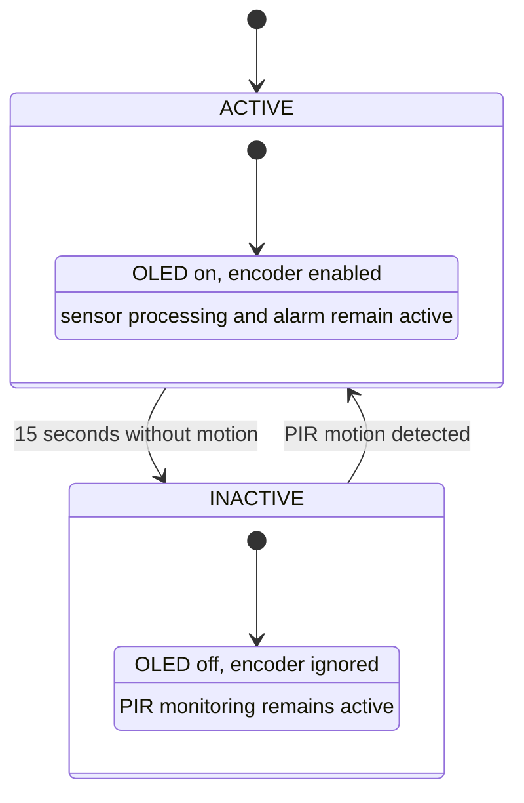

# bca182-freertos-multisensor

# BCA182 FreeRTOS Multisensor Monitor

## Project Overview

A simulated STM32 Blue Pill environmental monitor built with STM32Cube HAL and FreeRTOS. It samples temperature, humidity, ambient light, and motion; presents sensor pages on an SSD1306 OLED; navigates pages with a rotary encoder; and controls a buzzer alarm and inactivity state.

## Features

- DHT22 temperature and humidity acquisition.
- LDR sampling through the STM32 ADC, reported as a normalized 0-100% ADC scale rather than calibrated lux.
- OLED pages for temperature, humidity, light, and motion.
- Rotary-encoder page navigation.
- Temperature alarm thresholds below 18 C and above 30 C.
- PIR monitoring with a 15-second inactivity transition and motion wake.
- FreeRTOS task queues, event-group state signaling, and mutex-protected serial diagnostics.

## Learning Objectives

- Build periodic FreeRTOS tasks and select task priorities based on response latency.
- Transfer sensor snapshots using queues rather than shared mutable data.
- Coordinate independent events with an event group and block on queue sets.
- Separate deterministic decisions from hardware side effects for unit testing.
- Verify embedded behavior in Wokwi and record actual results.

## System Architecture



### FreeRTOS Architecture

| Task | Priority | Period / wait | Responsibility |
|---|---:|---|---|
| MotionTask | 3 | 100 ms | Poll PIR, enforce the inactivity timeout, and publish state transitions. |
| InputTask | 3 | 10 ms | Read encoder detents and send a `DisplayMode` selection. |
| SensorTask | 2 | 2000 ms | Read DHT22, ADC, and motion state; publish sensor snapshots. |
| AlarmTask | 2 | Queue-blocked | Evaluate temperature and control the buzzer/event bit. |
| DisplayTask | 1 | Queue-set-blocked | Sole owner of OLED operations; render sensor pages and state changes. |

The scheduler uses the project's ARM Cortex-M3 FreeRTOS port with a 100 Hz TIM3 tick. Periodic tasks use `vTaskDelayUntil()`; queue consumers block while there is no work.

## Hardware / Simulated Components

The system runs in Wokwi using an STM32 Blue Pill, DHT22, photoresistor module, PIR sensor, KY-040 rotary encoder, SSD1306 OLED, and buzzer.

## Pin Configuration

| Component signal | Blue Pill pin | Function |
|---|---|---|
| DHT22 data | PB0 | One-wire DHT22 protocol |
| LDR analog output | PA0 | ADC1 channel 0 |
| PIR output | PA3 | Digital motion input |
| Encoder CLK / DT | PA4 / PA5 | Quadrature input |
| OLED SCL / SDA | PB6 / PB7 | I2C1 |
| Serial TX / RX | PA9 / PA10 | USART1 serial monitor |
| Buzzer positive | PB10 | TIM2 channel 3 PWM |

All modules share 3V3 and GND as shown in `diagram.json`.

## Task Design

`SensorTask` samples environmental sensors every two seconds and publishes a `SensorData` snapshot. `MotionTask` polls the PIR every 100 ms. `InputTask` polls the encoder every 10 ms. `AlarmTask` and `DisplayTask` block until queue data or display events are ready. The DisplayTask is the only task that writes to the OLED.

## Inter-Task Communication



The sensor queues have length one and retain the newest snapshot. Separate queues ensure that the display and alarm consumers each receive their own copy. A queue set lets DisplayTask block on sensor data, page changes, or system-state transitions. A mutex serializes task-context serial messages.

## State Machine



The alarm decision is independent of the buzzer driver: `evaluateTemperature()` returns NORMAL, LOW_TEMPERATURE, or HIGH_TEMPERATURE, and AlarmTask applies the result to hardware.

## Repository Structure

```text
include/       Module interfaces, shared types, and FreeRTOS configuration
src/           Application tasks, hardware drivers, alarm/navigation/state logic
lib/FreeRTOS/  Vendored FreeRTOS kernel and STM32 port
system/        STM32 system initialization
test/          Native logic tests and verification records
diagram.json   Wokwi components and wiring
wokwi.toml     Wokwi firmware/ELF paths
platformio.ini PlatformIO firmware and native-test environments
```

## Getting Started

### Prerequisites

- Visual Studio Code with PlatformIO IDE.
- Wokwi Simulator extension.
- A host C++ compiler (`g++`) on PATH to run native tests.

### Building the Firmware

```sh
pio run -e bluepill_f103c8
```

The `bluepill_f103c8` environment is the default build environment. Firmware artifacts are written under `.pio/build/bluepill_f103c8/` and referenced by `wokwi.toml`.

### Running the Wokwi Simulation

Open `diagram.json` in Wokwi and start the simulation after building. The serial monitor is connected to USART1. DHT22 defaults are configured in `diagram.json`; click the simulated sensor controls or change its attributes to exercise temperature/humidity inputs. Adjust the photoresistor and PIR using their Wokwi controls.

### Unit Testing

```sh
pio test -e native
```

The native Unity suite has 13 cases: five temperature-alarm boundaries, four display-navigation transitions/wraparound cases, and four system-state transitions. A host C++ compiler must be available on PATH.

### Static Code Analysis

```sh
pio check -e bluepill_f103c8
```

The current report records low-severity HAL, interrupt-handler, and heap-library style notices; medium/high scans were clear. See `test/verification.md`.

### Functional Verification

Run FT-01 through FT-10 in Wokwi and record the observed behavior before marking each test PASS. The record is in `test/verification.md`.

## Engineering Decisions

- Use periodic `vTaskDelayUntil()` for stable sampling and encoder polling intervals.
- Keep sensor data in queues to avoid unsynchronized shared sensor globals.
- Use separate sensor queues for independent display and alarm consumers.
- Give the OLED a single task owner; other tasks communicate display requests by queue.
- Use a FreeRTOS event group for ACTIVE, MOTION, and ALARM status bits.
- Keep alarm classification as a pure function so threshold behavior can be tested without Wokwi hardware.
- Keep fault-injection experiments disabled by default in `include/fault_experiments.h`.

## Limitations

- LDR output is a normalized ADC percentage, not a calibrated lux measurement.
- Sensor and interaction behavior must still be verified in Wokwi; a successful build does not establish functional PASS results.
- The native unit tests cover deterministic logic, not HAL timing, I2C, ADC, or physical sensor behavior.
- The custom FreeRTOS port and simulation timing can affect scheduling observations; fault experiments may stall the simulator.

## Required Visual Evidence

The circuit and finished-system screenshots must be captured from the actual Wokwi project. They are intentionally not fabricated here. Capture and add:

1. Wokwi circuit screenshot showing the complete pin wiring.
2. Finished-system screenshot showing the running OLED and sensor setup.

Suggested paths are `docs/images/wokwi-circuit.png` and `docs/images/finished-system.png`. Add captions describing the technical point shown. The Mermaid architecture, task-communication, and state-machine diagrams above are source-controlled technical visuals.

## Future Improvements

- Add an actual calibrated lux conversion after selecting and documenting the LDR circuit model.
- Add OLED rendering and PIR/state integration tests using hardware mocks.
- Add user-configurable alarm thresholds and persistent configuration.
- Capture and commit Wokwi evidence and complete all actual-result fields in the verification record.

## References and Acknowledgments

- FreeRTOS Kernel documentation: https://www.freertos.org/Documentation/00-Overview
- PlatformIO documentation: https://docs.platformio.org/
- Wokwi documentation: https://docs.wokwi.com/
- STM32F1 HAL and CMSIS device support are provided by the STM32Cube framework.
